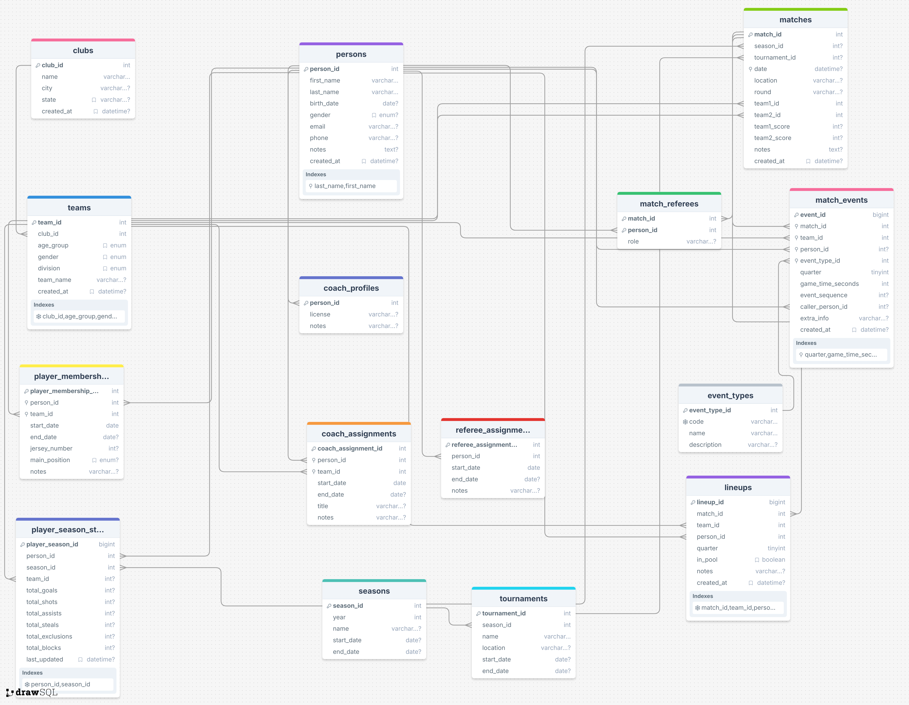

# Utah Club Water Polo Stats

My project models data that someone running a water polo club or league might find useful. It includes teams, players, match stats, referees, and seasonal performance.

 <!-- Replace with your schema image -->

---

## Query I thought it did well on

**Question**: Who are the top 5 scorers across all teams?

**GPT SQL Response**:
```sql
SELECT 
    p.first_name || ' ' || p.last_name AS player_name,
    SUM(pss.total_goals) AS total_goals,
    SUM(pss.total_assists) AS total_assists,
    SUM(pss.total_shots) AS total_shots
FROM
    player_season_stats pss
JOIN
    persons p ON pss.person_id = p.person_id
GROUP BY
    pss.person_id
ORDER BY
    total_goals DESC
LIMIT 5;
```
**Friendly Response:**
The top 5 scorers this season are:

    F5582 L5651 with 10 goals, 10 assists

    F5975 L7571 with 10 goals, 9 assists

    F8664 L6491 with 10 goals, 9 assists

    F7598 L6847 with 10 goals, 8 assists

    F1483 L5437 with 10 goals, 5 assists

## Question that it tripped up on:
GPT sometimes generates multiple SQL statements in one response, which SQLite cannot execute.

**Question:** Which 5 referees officiated the most matches?

GPT SQL Response:

```sql
Copy code
-- Top 5 referees
SELECT p.first_name || ' ' || p.last_name AS referee_name,
       COUNT(mr.match_id) AS matches_officiated
FROM match_referees mr
JOIN persons p ON mr.person_id = p.person_id
JOIN matches m ON mr.match_id = m.match_id
GROUP BY mr.person_id
ORDER BY matches_officiated DESC
LIMIT 5;
```
    SQL Result: None, because SQLite cannot execute multiple statements at once.

**Friendly Response:**
Unfortunately, GPT attempted multiple queries in a single block, so no results were returned. After sanitizing it to a single query, the top referees could be retrieved.

## Multi-shot Strategy
I tried a multi-shot strategy to guide GPT to return only one statement per question. This worked better for players’ stats but still sometimes returned confusing friendly responses. For example, it gave IDs instead of names for referees initially.

**Question (multi-shot):** Which 5 referees officiated the most matches?

    [(49, 2), (17, 2), (246, 1), (234, 1), (233, 1)]

**Friendly Response:**
The referees with IDs 49 and 17 officiated the most matches (2 each). Others had 1 match each. GPT didn’t automatically map IDs to names.

**Query I’d like to improve**
**Question:** Which teams have the most wins this season (top 5)?

GPT SQL Response:

```sql
Copy code
SELECT t.team_name, COUNT(*) AS wins
FROM matches m
JOIN teams t ON (m.team1_id = t.team_id AND m.team1_score > m.team2_score)
   OR (m.team2_id = t.team_id AND m.team2_score > m.team1_score)
WHERE m.season_id = (
    SELECT season_id
    FROM seasons
    ORDER BY start_date DESC
    LIMIT 1
)
GROUP BY t.team_id
ORDER BY wins DESC
LIMIT 5;
```
    SQL Error: near "ite": syntax error

**Friendly Response:**
It looks like I don't have the latest information on team wins for this season. I recommend checking a sports website or app for the most up-to-date standings.

## Conclusion
ChatGPT 4 preview does a solid job generating SQL for structured data like water polo stats. It handles joins and aggregates well for player and match stats.

However, multi-statement outputs and misinterpretation of results for friendly responses show that care is needed when presenting results to non-engineers. Sanitizing SQL and guiding GPT with more domain-specific examples helps reduce errors and improves readability.